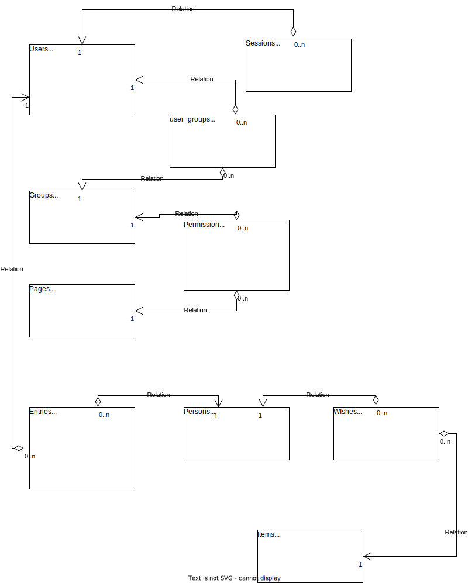

# Santa's own CRM

## Contents

- [Technologies](#technologies)
- [Development](#development)
- [User stories](#user-stories)
- [Database](#database)
- [Testing](#testing)

## Technologies

This project is written in TypeScript to take full advantace of it's typing. For database it uses Postgres, since it will ensure datas integrity: there will be no references to already removed objects like what might happen with NoSQL databases. End-to-end tests will be written with Cypress using Javascript, since I see little to gain with Typescript in case of e2e-tests. 

My first plan was to use microservices in this project, but I realized that it would make development (and testing) more complex and would bring no (or very little) gain on one person project. 

## Development

I will do iterations and my goal is to first just create a simple MVP and then start to build on top of that. I will use user stories as my guide on developing new features. 

For my development pipeline I will use Github and Github Actions. 

I am planning to publish production version to Docker Hub where is can be pulled and made to run on production servers. Having all the code in one repository makes it relatively easy to build a single docker-image to run the app. 

In addition to publishing, I will use Docker in development and testing as well. 

## User stories 

I will write some simple use stories to help me get started with the project. I am using a one-person-scrum as my project development method. As there is only one person working on the project, I am going to be both: Scrum-master and product owner. Plus all the other roles as well. So what I am trying to say, more user stories might appear on later iterations when I learn more about the funtionalities and requirements. 

| id | user | description | implemented | 
|----|------|-------------|-------------|
| 1. | admin | as an admin, I want to be able to manage access to different functionalities in the system | MVP |
| 2. | admin | as an admin, I want to be able to create new users | MVP |
| 3. | admin | as an admin, I want to be able to reset users passwords | MVP |
| 4. | admin | as an admin, I want to be able to disable accounts instantly | MVP |
| 5. | user | as an elf, I want to easily make entries to children when they behave well or badly | MVP |
| 6. | user | as an elf, I want to be able to register christmas wishes to children | MVP |
| 7. | user | as an elf, I want to easily see how nice or naugty a kid has been |- |
| 8. | user | as an elf, I want to see which wishes has been packed and are waiting in the Santas gift bag |- |
| 9. | user | as an elf, I would appriciate the abilitity to get smart suggestions for presents based on the wishlist | - |
| 10. | user | as Santa, I need to easily find the address of any child | MVP |
| 11. | user | as Santa, I really need to easily see who is nice and who is naughty | - |
| 12. | user | as Santa, I need to know what gifts are still waiting to be made |- |
| 13. | user | as Santa, I need to know where a family is going to get together to spend their christmas |- |
| 14. | user | as Santa, I'd like to easily see family relations to know the the parents are and what is sisters name etc. |- |

## Database

This is the first version of the relational model. It does not include support for all the features requested (=user stories 1.-14.) and address is stored just as a single text-field, but it should be sufficient enough to build MVP. 

## Testing

I will use Jest to run tests against backend and frontend. Testing is automated using Github Actions and tests always need to pass in order for the code to proceed in the pipeline. For e2e testing I'll be using Cypress. End-to-end tests are also run automatically with Github Actions.

I will use ESLint to enforce coherent syntax in the project. ESLint is also run automatically by Github Actions and code has to pass linting in order to proceed. 

Latest Release candidate is running in [Heroku](https://glacial-shore-58496.herokuapp.com/)
