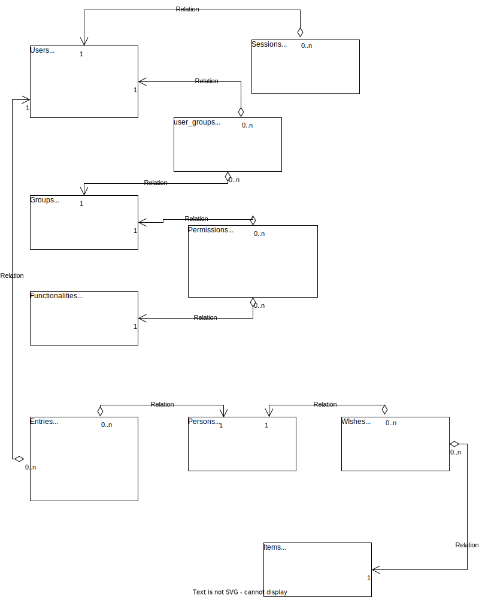

# Santa's own CRM

## Contents

- [Description](#description)
- [Development](#development)
- [User stories](#user-stories)
- [Wireframes](#wireframes)
- [Database](#database)
- [Testing](#testing)
- [Starting the app](#starting-the-app)
- [Hours spend](#hours-spend)

## Description

This repository contains my project for the [Full Stack -webapp](https://github.com/FullStack-HY/misc/blob/main/harjoitustyo.md). It is done as a part of [Full Stack Open -course](https://fullstackopen.com/). A course held by University of Helsinki. This project is mostly to showcase my skills with Node.js and React. I am planning to use TypeScript to take full advantace of it's typing. As I have no previous experience on building full stack -apps, planning of this app is mostly guided by my uncertainty. 

When ready, this project should be fully functional CRM for Santa Claus where he can see who has been nice and who has been naughty. It will also contain childrens wishes for the Santa and possibly some suggestions based on those wished. 

For database I am planning to use Postgres, since it will ensure datas integrity: there will be no references to already removed objects like what might happen with NoSQL databases. 

## Development

I will do iterations and my goal is to first just create a simple MVP and then start to build on top of that. I will use user stories as my guide on developing new features. 

This repository contains two directories: [server](server) and [client](client). They contain all the code for this project. My first plan was to use microservices in this project and that would have user multiple separate repositories, but I realized that it would make development (and testing) more complex and would bring no gain on one person project. 

For my development pipeline I will use Github and Github Actions. My github repository will be formed in the following manner: 

```
[master] this is the production version - it's update trough pull requests from [release]
-> [release] this is a release candidate that has passed all the tests. It will automaticly be deployed to Heroku for live demo
  -> [develop] this branch is where I develop or where feature-branches are merger. Once working, it can be merged to [release]
    -> [feature-branches] new features will be developed in their own brances and merged to [develop] once ready for it. 
```

I am planning to publish production version to Docker Hub where is can be pulled and made to run on production servers. Having all the code in one repository makes it relatively easy to build a single docker-image to run the app. 

In addition to publishing, I will use Docker in development and testing as well. 

## User stories 

I will write some simple use stories to help me get started with the project. I am using a one-person-scrum as my project development method. As there is only one person working on the project, I am going to be both: Scrum-master and product owner. Plus all the other roles as well. So what I am trying to say, more user stories might appear on later iterations when I learn more about the funtionalities and requirements. 

| id | user | description | 
|----|------|-------------|
| 1. | admin | as an admin, I want to be able to manage access to different functionalities in the system |
| 2. | admin | as an admin, I want to be able to create new users | 
| 3. | admin | as an admin, I want to be able to reset users passwords | 
| 4. | admin | as an admin, I want to be able to disable accounts instantly |
| 5. | user | as an elf, I want to easily make entries to children when they behave well or badly | 
| 6. | user | as an elf, I want to be able to register christmas wishes to children | 
| 7. | user | as an elf, I want to easily see how nice or naugty a kid has been |
| 8. | user | as an elf, I want to see which wishes has been packed and are waiting in the Santas gift bag |
| 9. | user | as an elf, I would appriciate the abilitity to get smart suggestions for presents based on the wishlist | 
| 10. | user | as Santa, I need to easily find the address of any child |
| 11. | user | as Santa, I really need to easily see who is nice and who is naughty | 
| 12. | user | as Santa, I need to know what gifts are still waiting to be made |
| 13. | user | as Santa, I need to know where a family is going to get together to spend their christmas |
| 14. | user | as Santa, I'd like to easily see family relations to know the the parents are and what is sisters name etc. |

## Wireframes 

Started working on wireframes just to noticed it's futility. Wireframes are drawn when needed and if needed. Since I am no UX-designed anyways, the pages will live their own life while I do iterations in the development process. 

Some ideas are in the [Docs](Docs) directory. 

## Database



This is the first version of the relational model. It does not include support for all the features requested and address is stored just as a single text-field, but it should be sufficient enough to build MVP. 

## Testing

I will use Jest to run tests against backend and frontend. Testing is automated using Github Actions and tests always need to pass in order for the code to proceed in the pipeline. For e2e testing I'll be using Cypress. Like tests written using Jest, e2e tests are also run automatically with Github Actions. Tests can also be easily performed by developer using Docker. 

I will use ESLint to enforce coherent syntax in the project. ESLint is also run automatically by Github Actions and code has to pass linting in order to proceed. 

Latest Release candidate is running in [Heroku](https://glacial-shore-58496.herokuapp.com/)

## Starting the app

#### Dev-mode

Requirements:
- Docker
- Docker-Compose

Clone the repository and run `npm install --prefix server` and `npm install --prefix client` in repository root. After all dependencies are installed, you can start the app in development mode by running command `docker-compose -f docker-compose.dev.yml up`. Modifications to server and client force them to reload automatically. App can be accessed from `http://localhost:3000`. 

## Hours spend

I've tried to write time all the hours put on the project. In case of half hour, I've sometimes rounded down, sometimes up (50-50). 

[hours spend](Docs/spend_hours.md)
